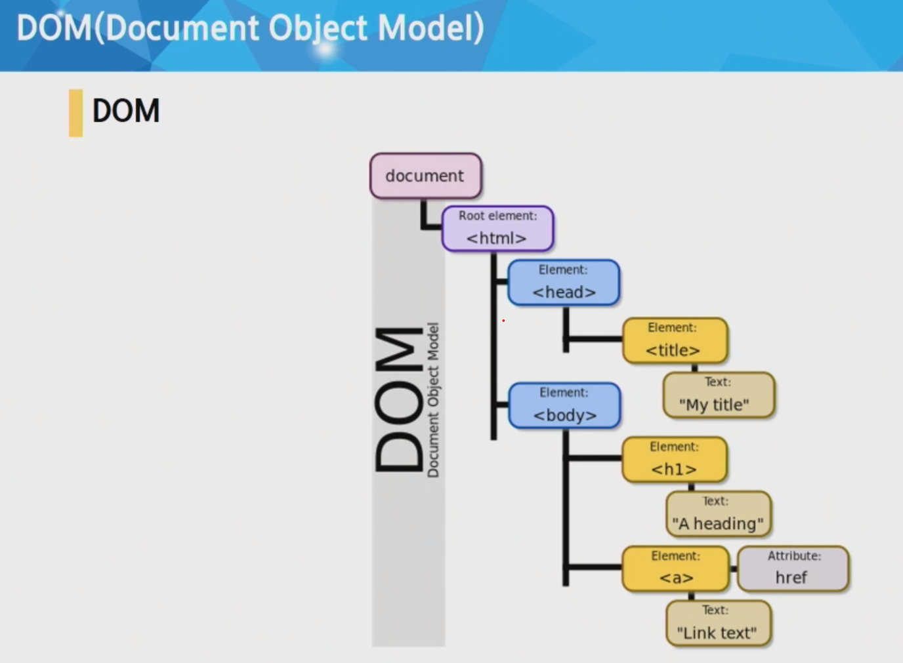
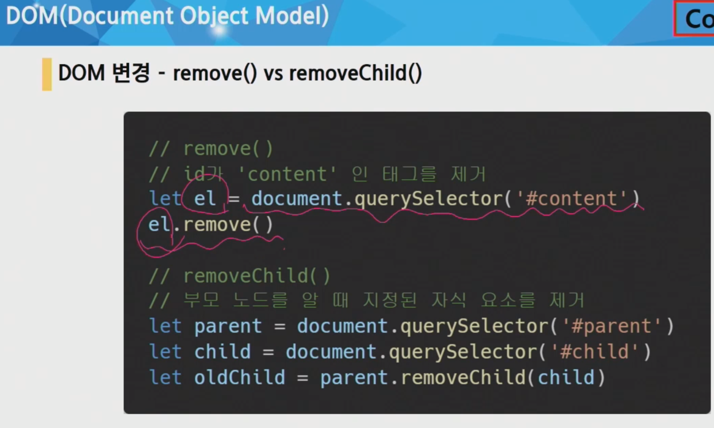
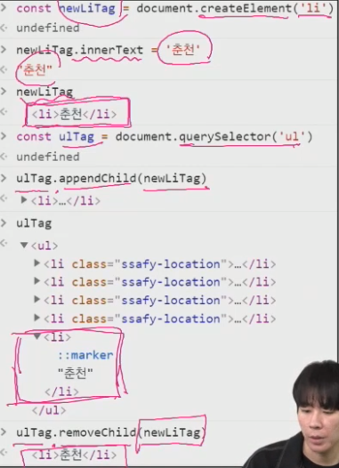
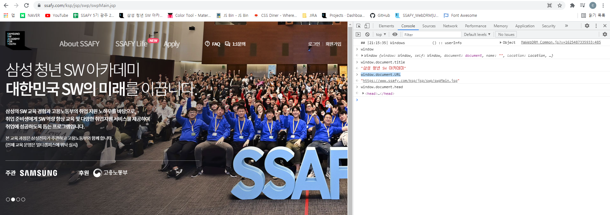
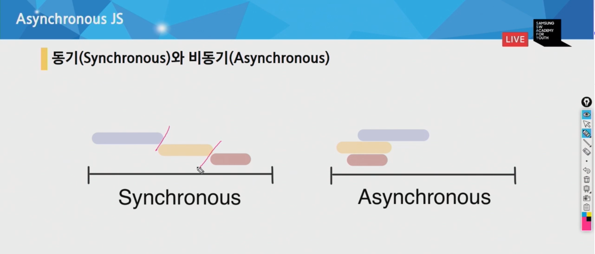
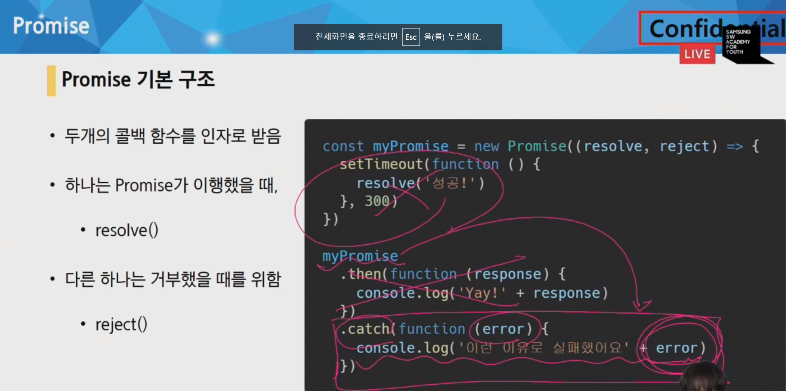
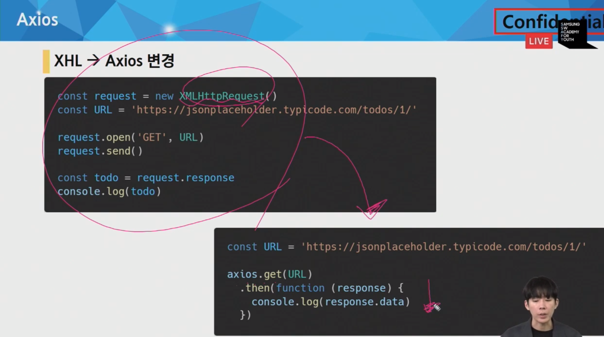

## JavaScript


[toc]


## 기본

- js의 주석은 // 다.
- 


## DOM (Document Object Model)

- DOM조작
  - 문서(HTML)조작
  - 문서가 구조화 되어있으며, 각 요소는 **객체**로 취급
  - 주요객체
    - window : 가장 최상위의 객체 (작성시 생략 가능)
    - document : body등과 같은 수많은 요소를 포함



- DOM 조작 = document는 문서 한 장(HTML)에 해당하고 이를 조작하는 것

- **조작 순서**

  - 1. 선택

    - Document.querySelector()
      - 제공한 선택자와 일치하는 element 하나 선택
      - 첫번째 element 객체를 반환
    - Document.querySelectorAll()
      - 제공한 선택자와 일치하는 여러개 element 선택
      - CSS selector를 인자로 받음
      - NodeList

  - 2. 변경

    - Document.createElement()
      - 주어진 태그명을 사용해 HTML 요소를 만들어 반환
    - ParentNode.append()
      - 추가할 수 있음
      - 여러개 삽입가능
      - 반환값은 없음
    - Node.appendChild()
      - 하나의 노드만 특정노드의 자식노드로 삽입가능
      - 한개만 추가 가능

    - ChildNode.remove()
    - Node.removeChild()
      - 부모.removeChild(자식노드)
      - 자식노드를 지우고, 지워진 자식노드를 반환함
      - 반환값이 있어서 변수로 할당 가능

    

    - Node.innerText()
      - 문자열 그 자체가 들어감
      - <li>춘천</li>을 치면
      - ''<li>춘천</li> ''그대로 나옴
    - Node.innerHTML
      - <li>춘천</li> 치면
      - ''춘천''이 나옴

    

    - Element.setAttribute(name,value)
      - 지정된 요소의 값을 설정
    - Element.getAttribute
      - 해당 요소의 지정된 값을 반환
      - 인자는 얻고자 하는 속성의 이름


```html
## console 안에서

window.document.title

window.document.URL

등등으로 문서를 조작가능
```




- Collection
  - Live Collection
    - 문서가 실시간으로 업데이트
    - 변경사항이 실시간으로 Collection에 반영됨
    - ex) NodeList, HTMLCollection
  - Static Collection (non-live)
    - DOM이 변경되어도 Collection 내용에 영향주지 않음
    - querySelectorAll()이 리턴하는 NodeList만 static임. (원래는 Live Collection 맞음)


- Event
  - 네트워크 활동 혹은 사용자와의 상호작용 같은 사건의 발생을 알리기 위한 객체
  - 이벤트 처리기
    - EventTarget.addEventListener(type, listener[,options])
      - type: 반응 할 이벤트 유형 (특정 이벤트)
      - listener:지정된 타입의 이벤트가 발생 했을 때 알림을 받는 객체 (할 일)
      - ex) 버튼.addeventlistener(클릭,새로고침)
    - 해당 메서드를 통해 다양한 요소에서 이벤트를 붙일 수 있음

```html
  <script>
    // 1
    const alertMessage = function () {
      alert('메롱!!!')
    }

    const myButton = document.querySelector('#my-button')
    myButton.addEventListener('click',alertMessage)
      
      ---
        
	const myTextInput = document.querySelector('#my-text-input')

    myTextInput.addEventListener('input', function (event) {
      // console.log(event)
      const myPtag = document.querySelector('#my-paragraph')
      myPtag.innerText = event.target.value
    })
```


- preventDefault()
  - 현재 이벤트의 기본 동작을 중단
  - 태그의 기본 동작 (a 태그는 클릭 시 페이지 이동, form 태그는 폼 데이터를 전송)
  - 이벤트 자체는 발생하는데, 이벤트가 하는 기본동작을 중단함.
  - ex) a태그를 클릭하면, a태그를 클릭했다는 이벤트는 남겨두지만, a태그의 기본동작인 페이지 이동은 막아버림.


## AJAX (비동기성)

- AJAX란
  - 페이지 전체가 아니라, 필요한 특정 일부분만을 업데이트
  - JSON을 써서 사용
- 동기와 비동기
  - 동기
    - 순차적, 직렬적 수행
    - 앞에 거가 끝나야 뒤에 거를 함
    - 요청을 보낸 후 응답을 받아야만, 다음 동작이 이루어짐 (blocking)
  - 비동기
    - 병렬적 태스크 수행
    - 동시에 수행이 가능함
    - 요청을 보낸 후 응답을 기다리지 않고, 다음 동작이 이루어짐 (non-blocking)




- 비동기를 왜 사용함?
  - 사용자의 경험을 위해서 !!
  - 앞에 구동한게 굉장히 크다면, 언제까지 기다리게 할건데?
  - 앱 자체가 멈춘것 처럼 보이게 됨


- Concurrency model
  1. call stack 
     - 요청이 들어올 때마다 해당 요청을 순차적으로 처리하는 stack 형태 구조
  2. Web API
     - javascript 엔진이 아니라 브라우저 영역에서 제공하는 API
     - java는 thread가 하나 밖에 없기 때문에 (single thread), 브라우저의 힘을 빌리는 것. (내가 일처리 지금 못할 거 같으니까 너가 대신좀 처리 해줘)
  3. task queue
     - 콜 백함수가 대기하는 Queue형태의 자료구조
     - main thread가 끝난 후 실행되어 후속 JavaScript가 차단되는 것을 방지
  4. event loop


- 순차적인 비동기 처리하기

1. Async callbacks
   - 백그라운드에서 실행을 시작할 함수를 호출할 때 인자로 지정된 함수
   - ex) addeventlistener()의 두번째 인자
2. Promise-style
   - 좀 더 새로운 코드 스타일, 더 현대적인 버전임


Promise object

- 비동기작업의 완료 or 실패를 나타내는 객체
  - 성공 = .then()
  - 실패 = .catch()
  - 어떻게 되든간에 = .finally()
    - finally는 어떠한 인자도 전달 받지 않음.
    - 무조건 실행되어야 하는 절이 필요하다면 활용
- .then을 여러개 사용하여 연쇄적인 작업(chaining)을 수행할 수 있음.
- 반드시 반환 값이 있어야함!




- Axios
  - https://github.com/axios/axios
  - 원래는 XHR을 통해 AJAX를 처리하는데
  - 이보다 편리하게 AJAX요청이 가능하게 도움을 줌




---

## 계산


1. Strimnmg concatenation

```js
console.log('my'+'cat');
console.log('1'+2);
```


2. Numeric operators

```js
console.log(1+1); // add
console.log(1-1); // substract
console.log(1/1); // divide
console.log(1*1); // multiply
console.log(5%2); // remainder
console.log(2**3); // exponentiaion
```


3. Increment and decrement operators

```js
let counter = 2;
const preIncrement = ++counter;
// counter = counter + 1;
// preIncrement = counter;
console.log(counter, preIncrement)

const postIncrement = counter++;
// postIncrement = counter;
// counter + 1;

const postDecrement = counter--;
// postIncrement = counter;
// counter - 1;
```


4. Logical operaors: ||(or), &&(and), !(not)

```js
const value1 = false:
const value2 = 4 < 2;

console.log('or: ${value1 || value2}');
console.log('and: ${value1 && value 2}');
console.log(!value1);
// !는 값을 반대로 바꿔줌. value1이 false기 때문에 true로 바꿔줌

```


5. Conditional operators: if

```js
const name = 'coder';
if (name === 'chanin') {
    console.log('welcome, chanin!');
} else if (name == 'coder') {
    console.log('hi coder')
} else {
    console.log('unknown');
}
```


6. Ternary operator:
   - condition ? value1 : value2;

```js
console.log(name === 'chanin' ? 'yes' : 'no')
```


7. Switch statement

```js
const browser = 'IE';
switch (browser) {
    case 'IE' :
        console.log('go away!');
        break;
    case 'Chrome';
    case 'Firefox':
        console.log('love you');
       	break:
    // 이렇게 똑같게 출력할거면, chrome과 firefox처럼 붙여쓰면 됨.
        
    default:
        console.log('same all!!')
        break;
        
}
```


8. Loops

```js
let i = 3;
while (i > 0) {
    console.log ('while: ${i}');
    i--;
}
```


---

new


---

### 추가로 알 것

- BOM (Browser Object Model)
  - 문서가 아닌 브라우저 자체를 조작

```html
# 별로 크게 중요하지는 않음.

location.host

location.pathname
```


