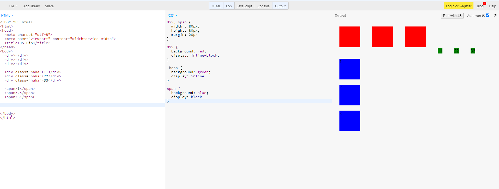
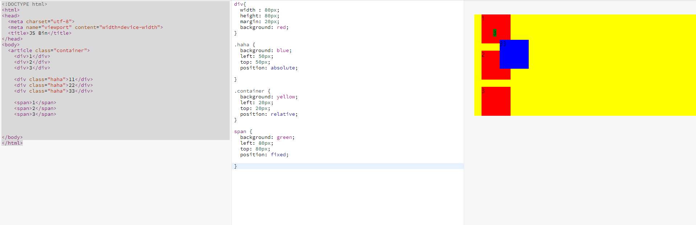

## Display, Position


기본값이 position : static 이기 때문에, relative로 설정해 줘야 우리가 원하는 offset을 사용할 수 있다.

offset = top,bottom,left,right


### inline, block

- inline = 물건 (컨텐츠), 컨텐츠에 딱 맞춰서 나옴
- block = 상자 (한 줄에 하나씩 들어가는 상자)
- inline = 한 줄에 다 넣는데, block 단위로 하는 것임


```html

<!DOCTYPE html>
<html>
<head>
  <meta charset="utf-8">
  <meta name="viewport" content="width=device-width">
  <title>JS Bin</title>
</head>
<body>
  <div></div>
  <div></div>
  <div></div>
  
  <div class="haha">11</div>
  <div class="haha">22</div>
  <div class="haha">33</div>
  
  <span>1</span>
  <span>2</span>
  <span>3</span>

   
  
</body>
</html>
```


```css
div, span {
  width : 80px;
  height: 80px;
  margin: 20px
}

div {
  background: red;
  display: inline-block;
}

.haha {
  background: green;
  display: inline
}

span {
  background: blue;
  display: block
}
```


=> 결과



---


### position


- relative = 내가 원래 있어야 했던 위치를 기준으로
- absolute = 내가 담겨있는 상자안에서 움직이는 것. 속해있는 가장 가까운 부모? 를 기준으로
- fixed = 상자가 중요한게 아니라, 윈도우를 기준으로


```html

<!DOCTYPE html>
<html>
<head>
  <meta charset="utf-8">
  <meta name="viewport" content="width=device-width">
  <title>JS Bin</title>
</head>
<body>
  <article class="container">
    <div>1</div>
    <div>2</div>
    <div>3</div>

    <div class="haha">11</div>
    <div class="haha">22</div>
    <div class="haha">33</div>

    <span>1</span>
    <span>2</span>
    <span>3</span>

   
  
</body>
</html>
```


```css
div{
  width : 80px;
  height: 80px;
  margin: 20px;
  background: red;
}

.haha {
  background: blue;
  left: 50px;
  top: 50px;
  position: absolute;
    # container가 움직이면 그거 따라감. 화면에 고정된 거 아님 
}

.container {
  background: yellow;
  left: 20px;
  top: 20px;
  position: relative;
}

span {
  background: green;
  left: 80px;
  top: 80px;
  position: fixed;
  # container움직여도 안따라감. 화면에 고정된 것임.
}
```

=> **결과**




