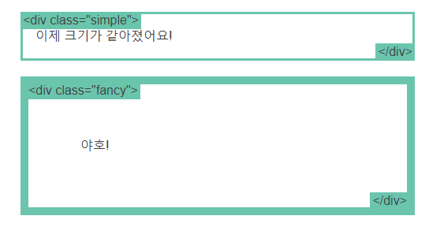

# CSS

### 엘리먼트

- block
  - `div`는 표준 블록 레벨 엘리먼트입니다. 블록 레벨 엘리먼트는 새 줄에서 시작해 좌우로 최대한 늘어납니다. 자주 볼 수 있는 다른 블록 레벨 엘리먼트로 `p`와 `form`이 있으며, HTML5에서 새로 추가된 엘리먼트로 `header`와 `footer`, `section` 등이 있습니다.

- inline

  - `span`은 표준 인라인 엘리먼트입니다. 인라인 엘리먼트는 단락 안에서 <span> 이처럼 </span> 해당 단락의 흐름을 방해하지 않은 채로 텍스트를 감쌀 수 있습니다. 링크에 사용하는 `a` 엘리먼트는 가장 흔히 볼 수 있는 인라인 엘리먼트입니다.

- none

  - 흔히 볼 수 있는 또 한 가지 `display` 값은 `none`입니다. `script`와 같은 일부 특별한 엘리먼트에서는 `none`을 기본값으로 사용하기도 합니다. 이 값은 자바스크립트에서 엘리먼트를 실제로 삭제하고 재생성하지 않고도 엘리먼트를 보이고 감추는 데 흔히 사용됩니다.

    이것은 `visibility`와 다릅니다. `display`를 `none`으로 설정하면 엘리먼트가 마치 존재하지 않는 것처럼 페이지가 렌더링됩니다. `visibility: hidden;`으로 설정하면 엘리먼트가 감춰질 테지만 해당 엘리먼트는 완전히 보이지 않게 되더라도 여전히 공간을 차지합니다.


ex) 

``` css
#main {
  width: 600px;
  margin: 0 auto; 
}

# 블록 레벨 엘리먼트의 width를 설정하면 컨테이너의 좌우 가장자리로 늘어나지 않게 할 수 있습니다. 그런 다음 좌우 마진을 auto로 설정해 해당 엘리먼트를 컨테이너 안에서 가로 중앙에 오게 할 수 있습니다. 엘리먼트는 여러분이 지정한 너비를 차지할 테고, 나머지 공간은 두 마진에 균등하게 나눠질 것입니다.

브라우저 창이 엘리먼트 너비보다 좁을 때 유일하게 문제가 발생합니다. 브라우저에서는 페이지에 가로 스크롤바를 만들어 이 문제를 해결합니다. 그럼 이 같은 상황을 개선해 봅시다...
```


---

### box-sizing

- 패딩과 테두리가 더는 너비를 늘리지 않게 맞춰주는 것

```css
.simple {
  width: 500px;
  margin: 20px auto;
  -webkit-box-sizing: border-box;
     -moz-box-sizing: border-box;
          box-sizing: border-box;
}

.fancy {
  width: 500px;
  margin: 20px auto;
  padding: 50px;
  border: solid blue 10px;
  -webkit-box-sizing: border-box;
     -moz-box-sizing: border-box;
          box-sizing: border-box;
}
```

