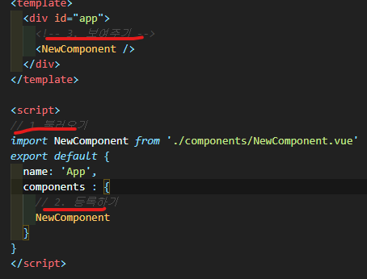
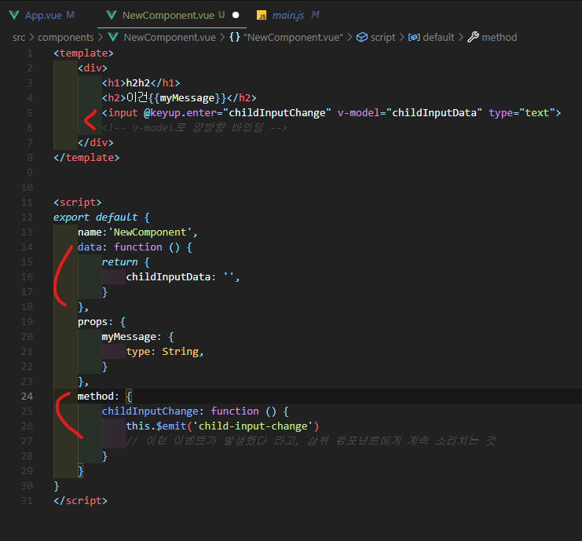
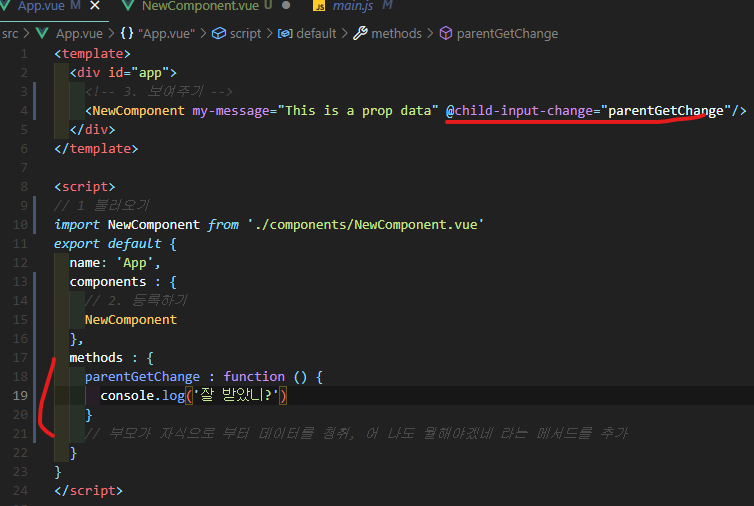
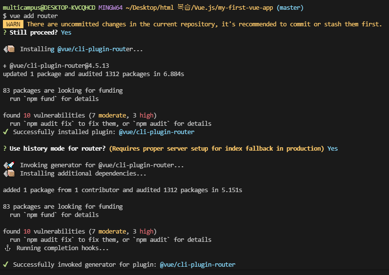
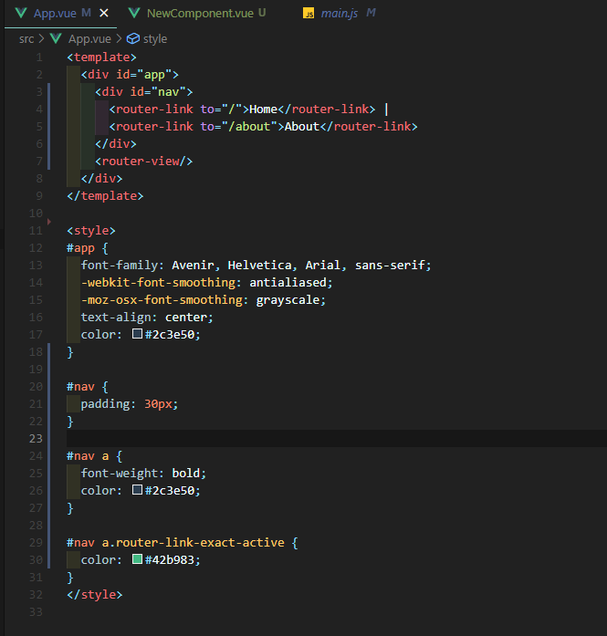

## Vue.js

- Vue란?

  - template

    - html 작성

  - script

    - js 작성

  - style

    - css 작성

    - ```vue
      # scoped를 하면 현재 이 문서에서만 적용되는 스타일이라는 것임.
      <style scoped>
      </style>
      ```


## Vue cli

### SFC

- Component(컴포넌트)
  - Vue 컴포넌트 === Vue 인스턴스
- SFC (single file component)
  - 컴포넌트 하나가 다 각각의 파일로 된거임


### Vue cli

- Vue.js 개발을 위한 표준 도구


### NPM

- python의 pip가 있다면 Node.js에는 NPM
- 자바스크립트 언어를 위한 패키지 관리자

- Component 보여주기 3단계

---




### Pass props

- 부모는 자식에게 데이터를 전달
- props는 아래로 (상위 컴포넌트의 정보를 하위로 전달하기 위한 특성)

```vue
# 상위 컴포넌트
# App.vue

<template>
  <div id="app">
    <!-- html에선 케밥케이스로 작성 -->
    <NewComponent my-message="This is a prop data"/>
  </div>
</template>
```


```vue
# 하위 컴포넌트
# NewComponent

<template>
    <div>
        <h1>h2h2</h1>
        <h2>이건{{myMessage}}</h2>
        // 2) 해당 이름을 머스태치? 스타일로 사용
    </div>
</template>


<script>
export default {
    name:'NewComponent',
    props: {
        // 1) props에 이렇게 받고
        myMessage: {
            type: String,
        }
    },
}
</script>


```


### Emit Events

- 자식은 부모에게 자신에게 일어난 일을 알림
- events는 위로
- $emit
- 부모 컴포넌트는 v-on을 사용하여 자식이 보낸 이벤트를 청취
- 부모가들을 이벤트 이름에는 케밥케이스를 권장 ex) my-event


```vue
# 하위 컴포넌트
# NewComponent
```




```vue
# 상위 컴포넌트
# App.vue
```




#### Vue router

- Vue router 설치
  - bash창에 Vue add router 입력
  - commit yes
  - history yes (반드시!!)



- 설치시 갑자기 App.vue가 바뀌어 있음 (원래 바로 위의 emit했을 때와 같은 코드였음)



- 중간에 추가해서 그렇지, 원래는 vue 시작할 때 vue add router해주면 됨.
- 또한 router와 views라는 폴더가 생성이 되어있음.


- router-link
  - index.js파일에 정의한 경로에 등록한 특정한 컴포넌트와 매핑
  - a 태그지만 우리가 알고있는 GET요청의 a태그와 다름 <- 기본 GET요청을 보내는 이벤트를 제거한 형태로 구성 (SPA로 하기 위해) == 페이지를 새로받은게 아니라, 단순히 다른 컴포넌트를 보여주는 것 뿐임.


- History mode
  - HTML history API를 사용해서 router를 구현한 것
  - 브라우저의 히스토리는 남기지만 실제 페이지는 이동하지 않는 기능을 지원
  - 뒤로가기, 앞으로가기 버튼 사용가능


- Vue router 왜씀?
  - Vue router는 라우팅의 결정권을 가진 Vue.js에서 라우팅을 편리하게 할 수있는 툴을 제공하는 라이브러리
  - 서버는 index.html 하나만 제공
  - 이후 모든 처리는 HTML 위에서 JS코드를 활용해 진행
  - 즉, 요청에 대한 처리를 더 이상 서버가 하지 않음. 할 필요가 없어짐
- 라우팅 처리 차이
  - SSR
    - 라우팅에 대한 결정권을 서버가 가짐
  - CSR (SPA)
    - 클라이언트는 더 이상 서버로 요청을 보내지 않고 응답 받은 HTML문서안에서 주소가 변경되면 특정 주소에 맞는 컴포넌트를 렌더링
    - 라우팅에 대한 결정권을 클라이언트가 가짐


---

