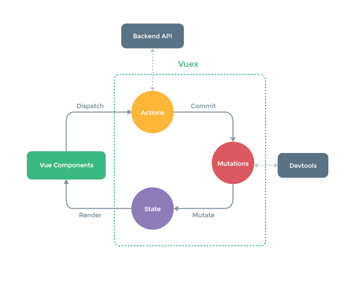

# Vuex

### Vuex란?

- 상태를 전역 저장소로 관리할 수 있도록 지원하는 라이브러리
  - state가 예측 가능한 방식으로만 변경될 수 있도록 보장하는 규칙 설정
  - 애플리케이션의 모든 컴포넌트에 대한 중앙 집중식 저장소 역할
  - 중앙 저장소에 state를 모아놓고 관리

- State
  - State는 data이며, 어플리케이션의 핵심이 되는 요소


> 단방향 데이터 흐름

- state는 앱을 작동하는 원본 소스 (data)
- view는 상태의 선언적 매핑
- action은 뷰에서 사용자 입력에 대해 반응적으로 상태를 바꾸는 방법 (methods)


> 상태 관리 패턴

- 컴포넌트의 공유된 상태를 추출하고 이를 전역에서 관리하도록 함.
- 모든 컴포넌트는 트리구조에 상관없이 상태에 엑세스하거나 동작을 트리거 할 수 있음
- 코드의 구조와 유지 관리 기능 향상


> Vuex 구성 요소
>
> 

- State
  - 중앙에서 관리하는 모든 상태 정보 (data)
  - Mutations에 정의된 메서드에 의해 변경
  - state가 변화하면, 이 state를 쓰고 있는 컴포넌트는 알아서 렌더링됨.


- Mutations
  - Actions에서 **commit()** 메서드에 의해 호출
  - 비동기적으로 동작하면 state가 변화하는 시점이 달라질수있기때문에동기적인 코드만 작성
  - mutations에 정의하는 메서드의 **첫 번째 인자로 state**가 넘어옴


- Actions
  - Component에서 **dispatch()** 메서드에 의해 호출
  - Backend API와 통신하여 Data Fetching 등의 작업을 수행
    - 동기적, 비동기적 작업을 모두 포함
  - 항상 **Context**가 인자로 넘어옴
  - mutations에 정의된 메서드를 **commit** 메서드로 호출


- Getters
  - statef를 변경하지 않고 활용하여 계산을 수행
  - computed와 거의 유사
  - getter자체가 state 자체를 변경하지는 않음
    - state를 특정한 조건에 따라 구분(계산)만 해서, 계산된 값을 가져옴


- map-- 시리즈

```js
# mapGetters

<script>
import {mapGetters} from 'vuex'
import TodoForm from '@/components/TodoForm'
import TodoList from '@/components/TodoList'
export default {
  name: 'App',
  components: {
    TodoForm,
    TodoList,
  },
  computed: {
    // completedTodosCount : function () {
    //   return this.$store.getters.completedTodosCount
    //   // 스토어에서 가져온 것임.
    //   //  <h2>completed Todo: {{completedTodosCount}} </h2> 이거를 바로 쓸 수 없기 때문에
    // },
    // uncompletedTodosCount : function () {
    //   return this.$store.getters.uncompletedTodosCount
    //   // 스토어에서 가져온 것임.
    //   //  <h2>completed Todo: {{completedTodosCount}} </h2> 이거를 바로 쓸 수 없기 때문에
    // }
    ...mapGetters([
      'completedTodoCount',
      'uncompletedTodosCount'
    ])
    // 해당 컴포넌트에서 매핑하고자하는 이름이 store의 index.js에 정의해놓은 getters의 이름과 동일하면 이렇게 쓸 수 가 있다.
    // 동일하게 mapState 등 나머지도 가능. 그대로 가져다 쓰는 것
    // import {mapGetters} from 'vuex' 이렇게 임포트를 해줘야 쓸 수 있음.
    // mapState는 Computed와 state를 매핑
    // mapGetters는 Computed와 Getters를 매핑
    // mapActions는 Computed와 Actions를 매핑
```


```js
# mapActions

<template>
    <div>
        <span
            @click="updateTodo(todo)">
            :class="{completed: todo.completed}"
            <!-- 이거 뭔지 모르겠음 -->
            {{todo.title}}</span>
        <button @click="deleteTodo(todo)">delete</button>
    </div>
</template>

<script>
import { mapActions } from 'vuex'
export default {
    name:'TodoListItem',
    props: {
        todo: {
            type: Object,
        }
    },
    methods: {
        // deleteTodo: function () {
        // // console.log('Todo 삭제')
        // this.$store.dispatch('deleteTodo', this.todo)
        // },
        // updateTodo: function () {
        //     // console.log('수정')
        //     this.$store.dispatch('updateTodo', this.todo)
        // }
        ...mapActions([
            'deleteTodo',
            'updageTodo'
            
        // mapAction을 할때는 dispatch에 this.todo라는 인자가 있었음.
        // 근데 지금은 dispatch는 하는데 인자를 못넘겨주는 것임.
        // 인자를 넘겨줘야하는데 여기는 문자열이라 못넘겨주고,
        // html에서 @click="updateTodo(todo)" 이렇게 괄호열고 보내줘야한다!!
        ])
    }
}
</script>

<style scoped>
    .completed {
        text-decoration: line-through;
    }

</style>
```


### createPersistedState

- 새로고침을 하더라도 저장해놓은 것들이 사라지지 않음.

```bash
# 1. 이하를 bash에 쳐서 설치
npm install --save vuex-persistedstate

# 2. plugin이기 때문에 등록을 해줘야함. 

# 3. import를 해줌
import createPersistedState from "vuex-persistedstate";

# 4. index.js 맨위에 배열로 집어넣음.
plugins: [
    createPersistedState(),
  ],  
  
# index.js

import Vue from 'vue'
import Vuex from 'vuex'
import createPersistedState from "vuex-persistedstate";

Vue.use(Vuex)

export default new Vuex.Store({
  plugins: [
    createPersistedState(),
  ],
  state: {
    todos: [
    ]
  },
```


---

## 실행방법

1. 컴포넌트에서 `dispatch`를 활용해 actions를 호출
2. actions에 정의된 메서드는 `commit`을 활용해 mutations 호출
3. mutations에 정의된 메서드는 `state`를 조작한다.


