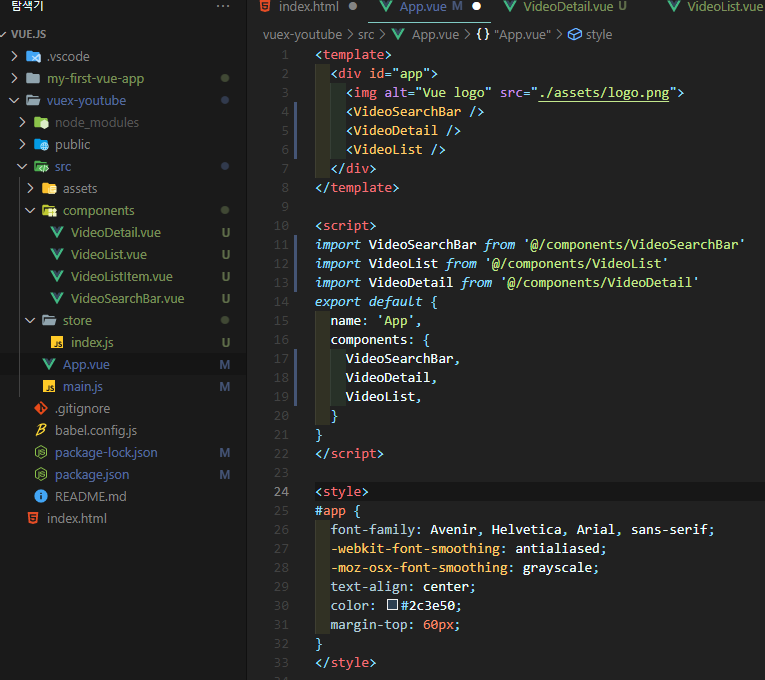
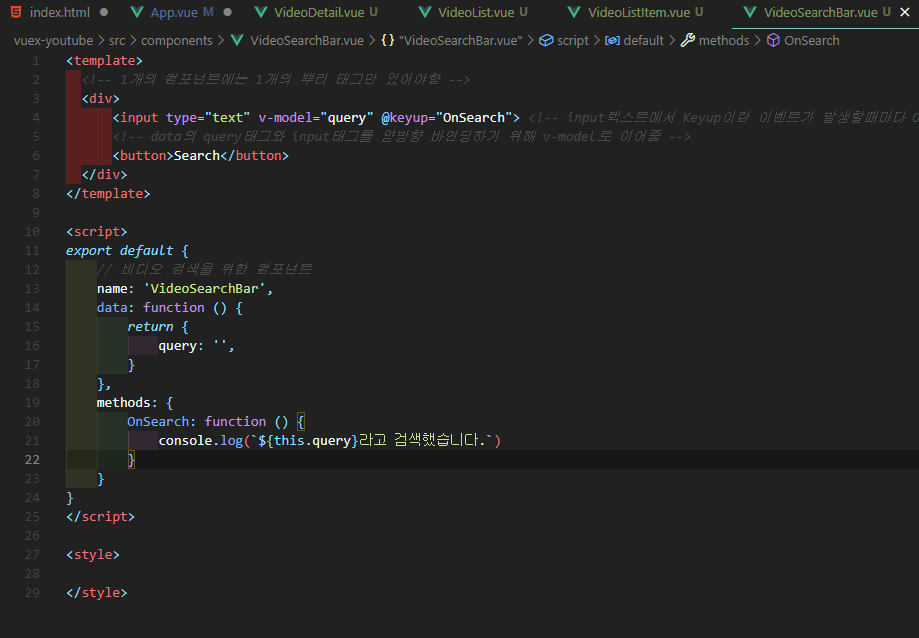
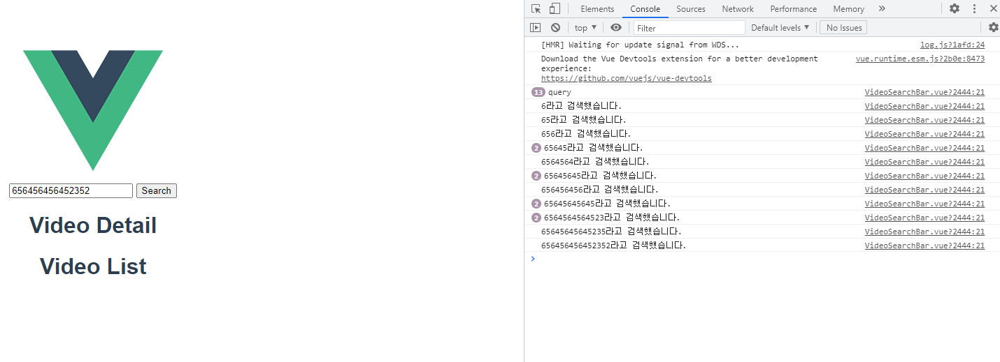

## Vuex

```bash
# vue 생성
vue cretae vuex-youtube

# 폴더로 들어가기
cd vuex-youtube

# 서버 실행해보기
npm run serve

# vuex 설치
vue add vuex
```


- vuex 설치하면 src > **store** 가 생성 돼있음.
- store
  - store가 인공위성처럼 컴포넌트들이 데이터를 보내면 소통하듣이 주고받음.
  - 이 안에 4가지가 있음.
    - state : 데이터
    - mutations : 데이터를 저장할 때 씀 (동기만 가능)
    - actions : methods 같은 것 (비동기, 동기 다 가능)
    - modules :  Store가 너무 커지면 분리할 때 사용
    - getters : vue의 computed와 똑같음

---

### 코딩

1. component 들어가서 VideoSearchBar.vue 생성
2. 생성 후 vue입력 후 태그하여 기본 틀 생성
3. 기본정보 입력

4. 여러 vue 컴포넌트 파일 생성 후
5. App.vue에서 등록



- 기본준비 완료
- 이제 부터 component 별로 작성


---

### VideoSearchBar.vue

```vue

<template>
  <!-- 1개의 컴포넌트에는 1개의 뿌리 태그만 있어야함 -->
  <div>
      <input type="text" v-model="query" @keyup="OnSearch"> <!-- input텍스트에서 Keyup이란 이벤트가 발생할때마다 OnSearch이벤트가 발생한다 -->
      <!-- data의 query태그와 input태그를 양방향 바인딩하기 위해 v-model로 이어줌 -->
      <button>Search</button>
  </div>
</template>

<script>
export default {
    // 비디오 검색을 위한 컴포넌트
    name: 'VideoSearchBar',
    data: function () {
        return {
            query: '',
        }
    },
    methods: {
        OnSearch: function () {
            console.log(`${this.query}라고 검색했습니다.`)
        }
    }
}
</script>

<style>

</style>

```





---

### index.js

```js
dasd
```


자바 짧은특강

controller = 통신시켜주느놈

dao.user = db에 접근할 것임


