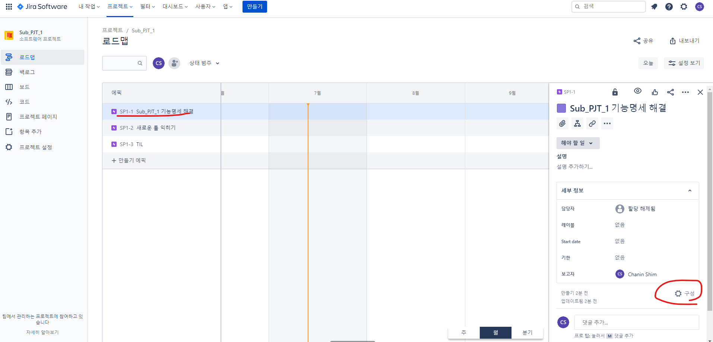
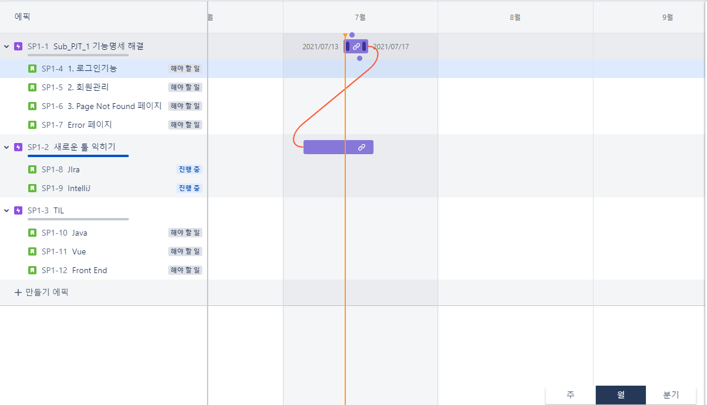
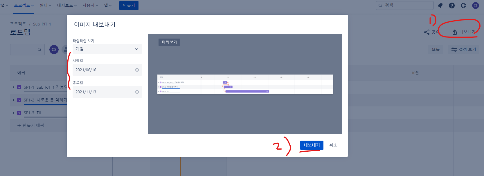
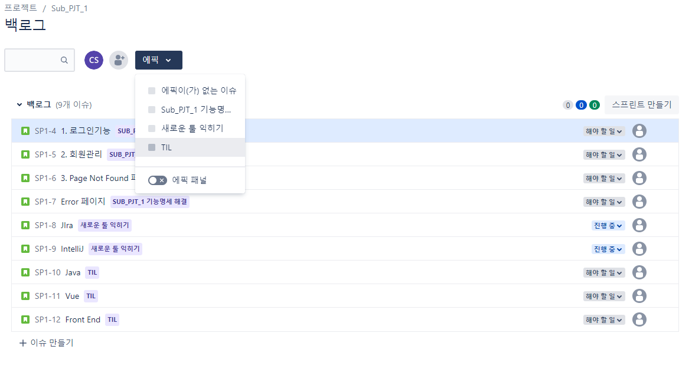
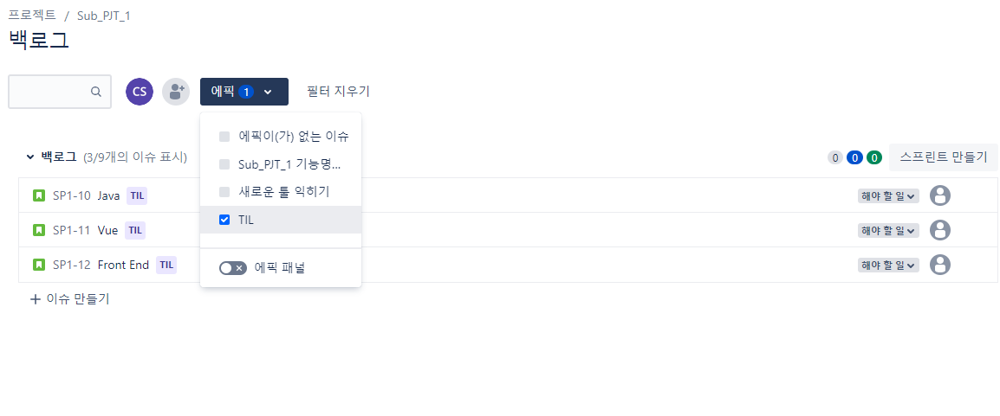
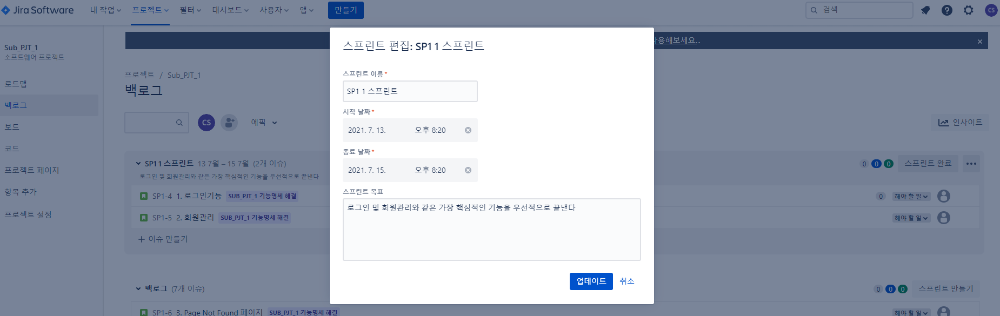
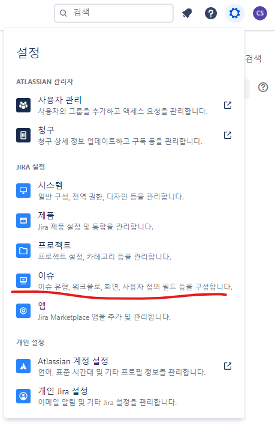

## Jira

> Jira란?

- 이슈 추적 소프트웨어로 버그 추적, 이슈 추적, 프로젝트 관리 기능 제공
- 작업 계획을 짧은 단위로 세우고, 싸이클을 반복하는 애자일 방식에서 사용하기 적합한 방식
- 변화에 유연하고 신속하게 계획 수정 가능.

---

### template

- kanban
  - 운영할 때?
- Scrum
  - 제일 일반적임
- Bug tracking
  - 버그만 주구장창 잡을 때

---

### Roadmap 

> 깔끔하게 로드맵을 보여줌

- issue type
  - story 
    - 유저가 어떠한 일을 해야하는지를 스토리라인으로 해놓은것.
  - task
    - 할일
  - bug
    - 버그 발생했을 때
  - epic
    - 하나의 큰 틀, 하나의 테마
    - 여기 안에 필요한 이슈들을 넣어두 됨
    - 가장 먼저 에픽을 생성
    - 명명하고, start date ~ 기한을 통해서 날짜 설정 가능
    - 생성한 에픽에서 구성을 클릭

- 마우스를 올리면 동그라미가 나오는데, 드래그하면 디펜던시를 줄 수 있다.

- 또한 옆에 내보내기 기능으로, 원하는 주기에 맞는 jira를 내보낼 수 있다.

- status
  - To do
  - Done
  - In Progress

---

### Backlog

> 우리가 그래서 뭘 해야하는지 쭉 보여줌

- 필터기능

- 스프린트

  > 현재 스프린트에서 뭘 해야하는지
  - 드래그를 통해 생성가능하고, 날짜 및 개요를 기재
  - 보드가 생성됨

### Story points

- 몇시간 걸릴지 적어 놓는 것.

---

### Issue 상세

## JQL

- SQL과 비슷하게 사용

- JQL functions
  - 자주쓰이는 functions 들
  - endofdays(), startofdays()
  - endofweek(),startofweek()

대시보드 생성

Gadget 설정

스프린트 = 스크럼의 주기 단위

백로그 = 프로젝트에서 해얗는일
